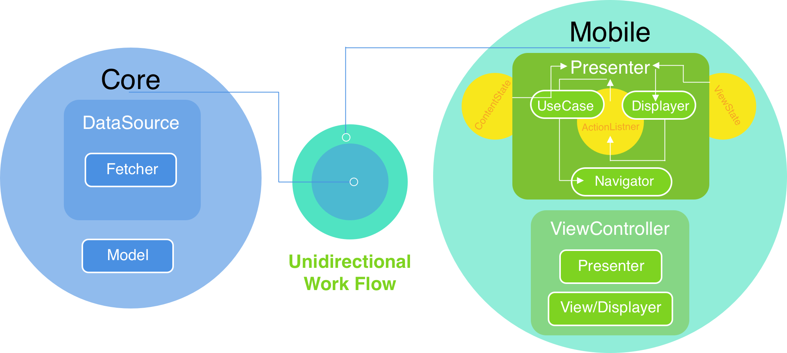

# Installation:

To install CocoaPods dependencies, go to project folder terminal and run following command:                                                                     
```
$ pod install
```

SnapshotTests should be run on iPhone 12 Pro Max (14.2) as it’s recorded considering it’s width and height.

# App:
3 Targets: Contacts, ContactsTests and ContactsUITests.

### Contacts:
Core and Mobile

### ContactsTests:
Core JSON Parsing Tests
ViewState, Presenter and UseCase Tests for Mobile
Snapshot Tests

### ContactsUITests:
UI Tests for ViewControllers/Views

# Architecture:


# Core:
### Model:
Exact representation of API Models, initialized by JSONInitializable Protocol.

### Fetcher:
A Protocol/Blueprint of method(s) for fetching API Models.

### DataSource:
A Protocol/Blueprint of method(s) for fetching API Models using Fetcher.

# Mobile:
### APIFetcher:
Actual implementation of Fetcher from the Core.
Owns APIService which does the network call(s).
Passed to DataSource from the Core to perform actual fetching.

### UseCase:
1. Fetches Data Models using DataSource.
2. Converts Data Models to **(ContentState + ViewState)** to handle initial, loading, idle and error states during Network call.
3. Holds all the business logic.

### Presenter:
1. Fetches Data using UseCase
2. Updates UI using:

   i. **Displayer**: An abstraction of the View.
   
   ii. **ViewState**: Domain Model converted to a Struct(something similar to View Model), has all the presentation logic for the View.
3. Listens to Actions in View using **ActionListener**: a Struct with the abstraction of all the possible actions in the View.
4. Supports Navigation by **Navigator**: A Protocol/Blueprint of all the possible navigation actions from a particular ViewController/View

### ViewController:
Most important component for any iOS App:
1. Holds the Presenter
2. Holds the Main View(that confirms to Displayer and owns the ActionListener for the presenter to listen to Actions in View) and passes it to Presenter
3. Injects Navigator to Presenter
4. Creates and Injects (UseCase + DataSource) to Presenter

It's kept as simple and dumb as possible and delegate most of the logic to the Presenter, which coordinates between the various necessary components.


##### *For any queries reach Shahrukh Alam at alam.shahrukh786@gmail.com or on 7349127046*
